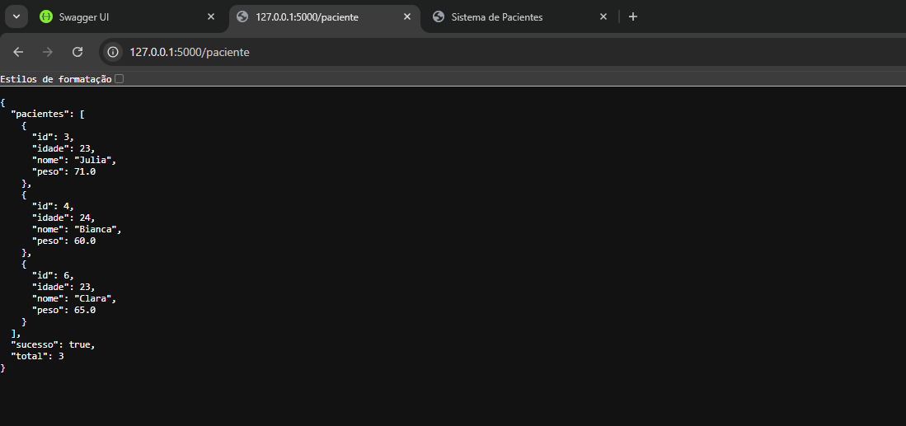

# 🏥 Sistema Clínico MVP

Este projeto MVP foi desenvolvido utilizando **Python (Flask)**, **SQLAlchemy**, **SQLite**, **Flask OpenAPI3 (Swagger)**, além de **HTML, CSS e JavaScript** no frontend.

O sistema simula uma aplicação clínica simples, permitindo o gerenciamento de pacientes e consultas, integrando frontend e backend.

---

## 🚀 Funcionalidades

O sistema realiza operações completas de CRUD:

- Cadastro de pacientes
- Listagem de pacientes
- Busca de paciente por ID
- Exclusão de pacientes
- Registro de consultas vinculadas a pacientes

---

## 🛠️ Tecnologias Utilizadas

- Python
- Flask (flask_openapi3)
- SQLAlchemy
- SQLite
- Flask-CORS
- HTML, CSS e JavaScript

---

## 💻 Frontend

O frontend foi desenvolvido em SPA (Single Page Application) utilizando HTML, CSS e JavaScript puro.

### Funcionalidades:
- Cadastro de pacientes (nome, idade e peso)
- Listagem de pacientes em tabela
- Remoção de pacientes
- Integração direta com API

### Acesso:
http://127.0.0.1:5000/app

### Imagem do Frontend:


---

## ⚙️ Backend (API)

O backend é responsável pelas regras de negócio, rotas e integração com o banco de dados.

### Acesso à listagem de pacientes:
http://127.0.0.1:5000/paciente

### Exemplo de resposta (GET /paciente):


---

## 📡 Endpoints da API
 
### 👤 Paciente
- POST /paciente → Criar paciente
- POST /paciente_json → Criar paciente via JSON
- GET /paciente → Listar pacientes
- GET /paciente/<id> → Buscar paciente por ID
- DELETE /paciente/<id> → Remover paciente

### 🩺 Consulta
- POST /consulta → Criar consulta vinculada a paciente

---

## 🗄️ Banco de Dados

- Tipo: SQLite  
- Arquivo gerado automaticamente: `database/db.sqlite3`

### Estrutura:
- Paciente (1)
- Consulta (N)

Relacionamento:
> Um paciente pode possuir várias consultas.

---

## 💻 Como Executar o Projeto

### 🔧 Backend

```bash id="b9x2ka"
cd Meu_app_api
python -m venv venv
venv\Scripts\activate
pip install -r requirements.txt
python app.py
