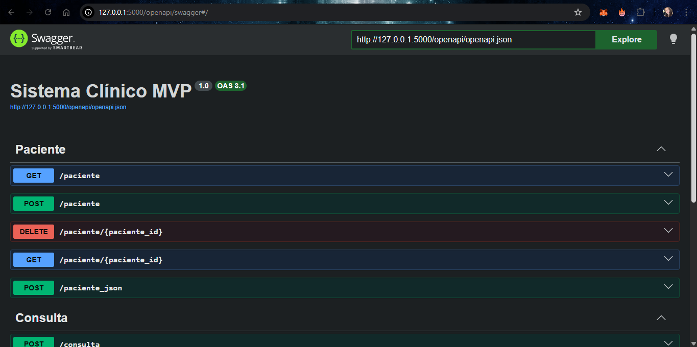

# Sistema Clínico MVP

Este projeto MVP foi desenvolvido utilizando **Python (Flask)**, **SQLAlchemy**, **SQLite**, **Flask OpenAPI3 (Swagger)**, além de **HTML, CSS e JavaScript** no frontend.

O sistema simula uma aplicação clínica simples, permitindo o gerenciamento de pacientes e consultas, integrando frontend e backend.

---

## Funcionalidades

O sistema realiza operações completas de CRUD:

- Cadastro de pacientes
- Listagem de pacientes
- Busca de paciente por ID
- Exclusão de pacientes
- Registro de consultas vinculadas a pacientes

---

## Tecnologias Utilizadas

- Python
- Flask (flask_openapi3)
- SQLAlchemy
- SQLite
- Flask-CORS
- HTML, CSS e JavaScript

---

## Frontend

O frontend foi desenvolvido em SPA (Single Page Application) utilizando HTML, CSS e JavaScript puro.

### Funcionalidades:
- Cadastro de pacientes (nome, idade e peso)
- Listagem de pacientes em tabela
- Remoção de pacientes
- Integração direta com API

### Swagger - Integração com a API

O Swagger (OpenAPI) é utilizado para documentar e testar todas as rotas da API de forma interativa, permitindo visualizar requisições e respostas em formato JSON.

### Acesso:
http://127.0.0.1:5000/app

### Imagem do Frontend:


---
## Swagger
O Swagger permite visualizar todas as rotas da aplicação (GET, POST, DELETE), facilitando o teste e entendimento da API.

### Acesso:
http://127.0.0.1:5000/openapi/swagger

### Funcionalidades:
- Visualização das rotas (GET, POST, DELETE)
- Teste direto das requisições
- Retorno em formato JSON
- Documentação automática da API

### Imagem do Swagger:



---
## Backend (API)

O backend é responsável pelas regras de negócio, rotas e integração com o banco de dados.

### Acesso à listagem de pacientes:
http://127.0.0.1:5000/paciente

### Exemplo de resposta (GET /paciente):


---

## Endpoints da API
 
### Paciente
- POST /paciente → Criar paciente
- POST /paciente_json → Criar paciente via JSON
- GET /paciente → Listar pacientes
- GET /paciente/<id> → Buscar paciente por ID
- DELETE /paciente/<id> → Remover paciente

### Consulta
- POST /consulta → Criar consulta vinculada a paciente

---

## Banco de Dados

- Tipo: SQLite  
- Arquivo gerado automaticamente: `database/db.sqlite3`

### Estrutura:
- Paciente (1)
- Consulta (N)

Relacionamento:
> Um paciente pode possuir várias consultas.

---

## Como executar o projeto (via terminal)

Siga os passos abaixo para executar a aplicação corretamente:

### 1. Abrir o terminal

No Windows, pressione `Win + R`, digite:

```
powershell
```

e pressione Enter.

---

### 2. Acessar a pasta do projeto

```
cd Documents\fullstack-mvp-flask-api
cd meu_app_api
```

---

### 3. Verificar os arquivos

```
dir
```

Deve aparecer o arquivo `app.py` na listagem.

---

### 4. Criar ambiente virtual

```
python -m venv .venv
```

---

### 5. Ativar ambiente virtual (Windows)

```
.\.venv\Scripts\Activate.ps1
```

Após ativar, o terminal exibirá:

```
(.venv)
```

---

### 6. Instalar dependências

```
pip install flask==2.3.3 werkzeug==2.3.7 flask-openapi3 sqlalchemy flask-cors pydantic
```

---

### 7. Executar a aplicação

```
python app.py
```

---

### 8. Acessar no navegador

Abra o navegador e acesse:

```
http://127.0.0.1:5000/openapi
```

Neste endereço será possível visualizar e testar a API utilizando o Swagger.

## Autora

Bianca Maria
Desenvolvedora do projeto

