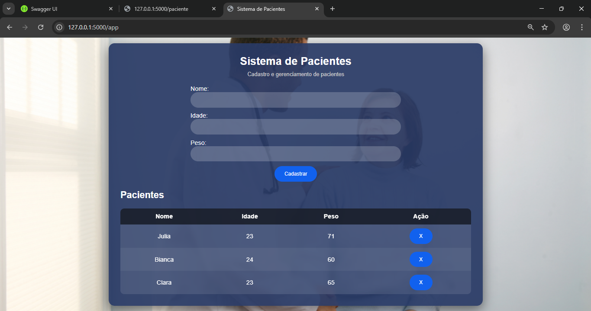

# 🏥 Sistema Clínico MVP

Olá, eu desenvolvi este trabalho MVP utilizando banco de dados SQLite, SQLAlchemy, Flask OpenAPI3 (Swagger), Python, HTML, CSS e JavaScript.

O sistema permite o funcionamento de uma API clínica para cadastro de pacientes, contendo informações como nome, idade e peso.

Através da rota:
http://127.0.0.1:5000/paciente  
é possível visualizar a lista de pacientes cadastrados no banco de dados.

O projeto demonstra a integração entre frontend e backend. Por exemplo:

- **GET** → buscar lista de pacientes  
- **POST** → cadastrar novo paciente  
- **DELETE** → remover paciente  

---

## 🚀 Funcionalidades

O sistema integra Frontend e Backend, funcionando de forma completa:

- Cadastro de pacientes  
- Listagem de pacientes  
- Exclusão de pacientes  
- Registro de consultas  

---

## 🛠️ Tecnologias Utilizadas

- Python  
- Flask  
- Flask OpenAPI3 (Swagger)  
- SQLAlchemy  
- SQLite  
- HTML, CSS e JavaScript  

---

## 💻 Frontend

O frontend foi desenvolvido com HTML, CSS e JavaScript.

Funcionalidades:

- Digitar nome, idade e peso  
- Cadastrar paciente  
- Exibir pacientes em tabela  
- Remover paciente  



---

## ⚙️ Backend

O backend é responsável pelas rotas da API e integração com o banco de dados.

Exemplo de resposta da rota `GET /paciente`:

```json
{
  "sucesso": true,
  "total": 3,
  "pacientes": [
    {
      "id": 3,
      "nome": "Julia",
      "idade": 23,
      "peso": 71.0
    },
    {
      "id": 4,
      "nome": "Bianca",
      "idade": 24,
      "peso": 60.0
    },
    {
      "id": 6,
      "nome": "Clara",
      "idade": 23,
      "peso": 65.0
    }
  ]
}