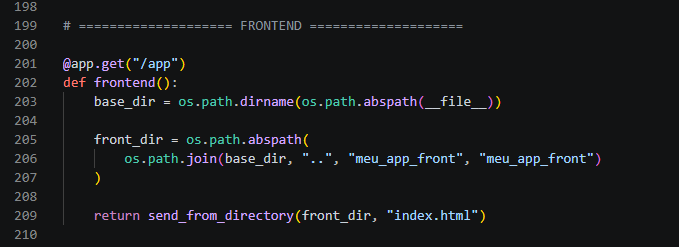

## Front-end

O front-end do projeto foi desenvolvido utilizando HTML, CSS e JavaScript puro, sem uso de frameworks, garantindo o funcionamento como uma Single Page Application (SPA) simples.

O objetivo do front-end é realizar a integração com a API (Swagger + endpoints) e exibir os dados de forma dinâmica na interface, como a listagem de pacientes em tabela.

------------------------
### Integração com a API

O front-end consome diretamente as rotas da API, como:

- GET /paciente → lista todos os pacientes
- GET /paciente/<id> → busca paciente específico
- POST /paciente → cadastra paciente
- DELETE /paciente/<id> → remove paciente

Essas requisições são feitas via JavaScript (fetch API), conectando o front-end ao backend documentado no Swagger.

----------------------------
### Estrutura do Front-end

O arquivo principal da aplicação é:
- index.html → contém HTML, CSS e JavaScript juntos

----------------------------
### Pois a Execução do Front-end via Flask

O front-end é servido pelo próprio backend Flask através da rota:

-----------------------------
### Acesso à aplicação

Para executar o front-end no navegador:
http://127.0.0.1:5000/app 

------------------------------
### Obeservação

O front-end funciona de forma integrada com o Swagger/API, permitindo visualizar e manipular os dados diretamente na interface, sem necessidade de ferramentas externas.